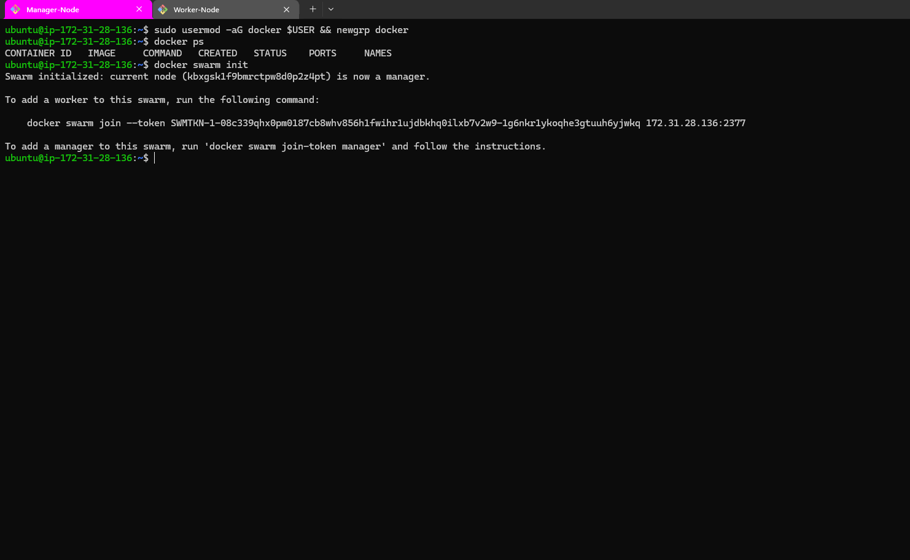

📘 Docker Swarm Multi-Service Deployment (Node.js + FastAPI)

🚀 Project Overview

This project demonstrates a multi-service architecture deployed using Docker Swarm, including:

- Node.js (NestJS) Application
- FastAPI (Python) Application
- Traefik Reverse Proxy (Dynamic Routing & Load Balancing)
- Multi-node Swarm Cluster (Manager + Worker)

Manager Node → Controls cluster & deployments
Worker Node → Runs application containers
Traefik → Handles routing + load balancing
Overlay Network → Enables communication across nodes

⚙️ Setup Steps

1️⃣ Create EC2 Instances
  1 Manager Node
  1 Worker Node
  
2️⃣ Install Docker

    sudo apt-get update
    sudo apt-get install docker.io -y
    sudo systemctl enable docker
    sudo systemctl status docker
  
3️⃣ Initialize Swarm (Manager Node)

      docker swarm init

👉 Open ports:

  2377 (Swarm)
  80 (Traefik)
  3000 (Node App)
  8000 (FastAPI)
  
4️⃣ Join Worker Node

    docker swarm join --token <TOKEN>

Check nodes:

  docker node ls
  
📦 Application Setup

🔹 Node.js Dockerfile

    FROM node:20-alpine AS builder
    
    WORKDIR /app
    COPY package*.json ./
    RUN npm install
    
    COPY . .
    RUN npm run build
    
  
    FROM node:20-alpine
    
    WORKDIR /app
    COPY --from=builder /app/dist ./dist
    COPY package*.json ./
    RUN npm install --production
  
    EXPOSE 3000
    CMD ["node", "dist/main.js"]

  
🔹 FastAPI Dockerfile

  
    FROM python:3.10-slim
    
    WORKDIR /app
    COPY requirements.txt .
    RUN pip install -r requirements.txt
    
    COPY . .
    
    EXPOSE 8000
    CMD ["uvicorn", "main:app", "--host", "0.0.0.0", "--port", "8000"]

  
🔹 .dockerignore

  Node.js
  
  node_modules
  .git
  .env
  dist
  
  Python
  
  __pycache__
  *.pyc
  .git
  .env
  
🐳 Build & Push Images
  docker build -t nest-app .
  docker build -t fastapi-app .

  
Tag Images

    docker tag fastapi-app:v1 <dockerhub>/fastapi-app:v1
  
    docker tag nest-app:v1 <dockerhub>/nest-app:v1
  
Push to Docker Hub
  
    docker push <dockerhub>/fastapi-app:v1
  
    docker push <dockerhub>/nest-app:v1

  
📄 Docker Stack Deployment

    docker-stack.yml
    version: "3.8"
    
    services:
      traefik:
        image: traefik:v2.9
        command:
          - --providers.docker=true
          - --providers.docker.swarmMode=true
          - --providers.docker.exposedbydefault=false
          - --entrypoints.web.address=:80
        ports:
          - "80:80"
        networks:
          - app-network
        volumes:
          - /var/run/docker.sock:/var/run/docker.sock:ro
        deploy:
          placement:
            constraints:
              - node.role == manager
    
      nest-app:
        image: <dockerhub>/nest-app:latest
        networks:
          - app-network
        deploy:
          replicas: 3
          labels:
            - traefik.enable=true
            - traefik.http.routers.nest.rule=Host("client-a.example.com")
            - traefik.http.services.nest.loadbalancer.server.port=3000
    
      fastapi-app:
        image: <dockerhub>/fastapi-app:latest
        networks:
          - app-network
        deploy:
          replicas: 3
          labels:
            - traefik.enable=true
            - traefik.http.routers.fast.rule=Host("client-b.example.com")
            - traefik.http.services.fast.loadbalancer.server.port=8000
    
    networks:
      app-network:
        driver: overlay

        
🚀 Deploy Stack

    docker stack deploy -c docker-stack.yml multiclient-stack

Check services:

    docker service ls

    docker stack services multiclient-stack

⚡ Scaling & Updates

🔹 Scale Service

    docker service scale multiclient-stack_fastapi-app=5
  
🔹 Rolling Update

    docker service update --image <dockerhub>/fastapi-app:v2 multiclient-stack_fastapi-app

  
✅ Benefits:

Zero downtime

One-by-one container replacement

Automatic load balancing

🔄 Rollback

    docker service rollback multiclient-stack_fastapi-app

  
🔀 Traefik (Reverse Proxy)

Why Traefik?

Auto service discovery
Dynamic routing
No manual config reload
Built for Docker & Swarm
Traffic Flow:
User → Traefik → Overlay Network → Service → Container

📸 Screenshots

   
Display in README:
## Screenshots

🧠 Key Learnings
Docker Swarm clustering
Multi-service deployment
Reverse proxy with Traefik
Rolling updates & zero downtime
Overlay networking
